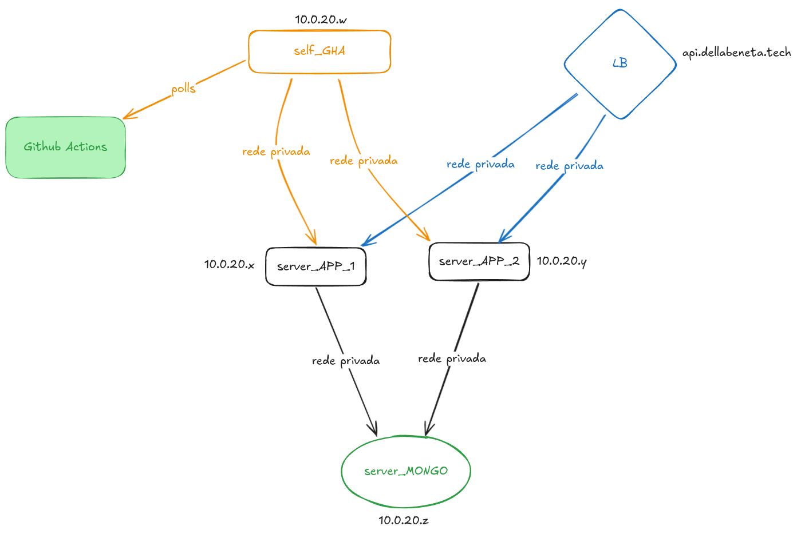

### Backend (API em Go)
- **Componentes Principais**:
  - API REST usando o roteador Gorilla Mux
  - Integração com MongoDB
  - Endpoints para gerenciamento de Pessoas (Criar e Buscar por CPF)

### Infraestrutura (Terraform)
- **Recursos DigitalOcean**:
  - Balanceador de Carga
  - Rede VPC
  - Droplets (Ubuntu 24.04)
  - Gerenciamento de chaves SSH
  - Instalação do MongoDB
  - Configuração de implantação da aplicação

### CI/CD
- **Pipeline GitHub Actions**:
  - Compila a aplicação Go
  - Implanta no servidor
  - Gerencia artefatos

<!-- ### Configuração Docker
- Configuração do Docker Compose com:
  - Container da aplicação Go
  - Container MongoDB
  - Persistência de volume -->

  ### Diagrama da Arquitetura
  

### Estrutura do Projeto
```
├── compose.yaml
├── configs
│   └── db.go
├── controllers
│   └── personController.go
├── diagram.png
├── Dockerfile
├── go.mod
├── go.sum
├── main.go
├── models
│   └── person.go
├── nuke.sh
├── README.md
├── routes
│   └── router.go
└── terraform
    ├── backend.tf
    ├── droplets.tf
    ├── loadbalancer.tf
    ├── mongo.sh
    ├── myapp.sh
    ├── network.tf
    ├── output.tf
    ├── provider.tf
    ├── sshkey.tf
    ├── terraform.tfvars
    └── variables.tf
```

A API possui dois endpoints principais:
1. `POST /api/pessoas` - Criar uma nova pessoa
2. `GET /api/pessoas/{cpf}` - Buscar pessoa por CPF